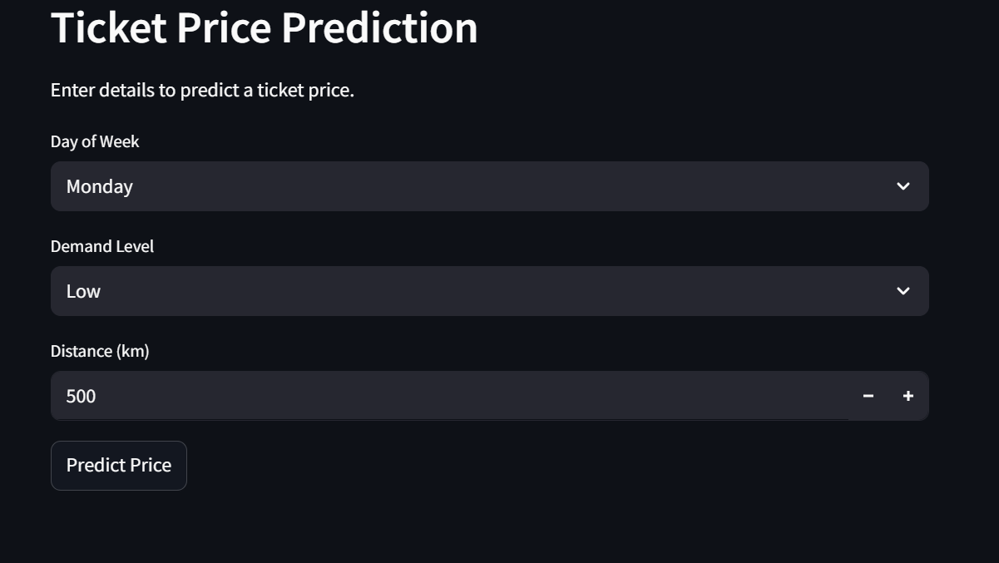

---

# ✈️ Airline Ticket AI

A dual-function AI system designed to enhance the airline customer experience with a **chatbot-based query classifier** and a **machine learning-based price prediction model**. Built using Python, PyTorch, Hugging Face Transformers, and Streamlit, the app classifies passenger queries and predicts flight ticket prices based on destination and timing.

---

## 📌 Project Overview

Airline Ticket AI is a smart, AI-driven assistant that addresses two critical airline use cases:

1. **Query Classification**: Automatically understands and classifies customer support queries using a fine-tuned DistilBERT model.
2. **Price Prediction**: Uses regression models to predict flight prices based on features like airline, departure time, duration, etc.

This project merges **natural language understanding** with **tabular regression modeling**, making it a compact demo of real-world AI integration.

---

## 🚀 Features

✅ **Chatbot Interface** – Classifies user queries into predefined categories and returns appropriate responses.  
✅ **Flight Price Predictor** – Provides ticket price estimates using cleaned tabular data.  
✅ **Interactive UI** – Built with Streamlit for a sleek and responsive user experience.  
✅ **Local & Colab Compatible** – Easily run locally or on Google Colab for low-resource systems.  
✅ **Extensible Design** – Modular code structure to add new airlines, routes, or model types.

---

## 🧠 Tech Stack

- **Python 3.10+**
- **NLP**: Hugging Face Transformers, DistilBERT
- **ML**: Scikit-learn, XGBoost
- **Deployment**: Streamlit, Gradio (optional), GitHub Pages
- **Data Processing**: Pandas, Numpy, Matplotlib, Seaborn

---

## 📁 Project Structure

```
airline-ticket-ai/
├── chatbot_model/              # DistilBERT model (generated, ~500MB, not in repo)
├── create_queries.py           # Generates synthetic query data
├── create_prices.py            # Generates synthetic pricing data
├── preprocess_data.py          # Preprocesses queries and prices
├── train_chatbot.py            # Trains DistilBERT model
├── test_chatbot.py             # Tests chatbot accuracy
├── train_pricing.py            # Trains Linear Regression model
├── test_pricing.py             # Tests pricing model
├── test_prototype.py           # Tests conversational chatbot and pricing
├── app.py                      # Streamlit app for chatbot and pricing
├── category_map.csv            # Maps category codes to names
├── processed_queries.csv       # Preprocessed query dataset
├── processed_prices.csv        # Preprocessed pricing dataset
├── pricing_model.pkl           # Trained Linear Regression model
├── scaler.pkl                  # Feature scaler for pricing
├── chatbot_results.txt         # Chatbot test results
├── pricing_results.txt         # Pricing test results
├── prototype_results.txt       # Conversational and pricing test results
├── interface_test.txt          # Manual interface test results
├── requirements.txt            # Dependencies
├── .gitignore                  # Excludes large files (e.g., chatbot_model/)
├── README.md                   # This file
```

---

## 🚀 Deployment Steps

Follow the steps below to generate data, train models, and run the app locally or on a remote server like Streamlit Cloud or Google Colab.

### 🧾 1. Generate Synthetic Data

Run the following scripts to generate and preprocess both query and pricing datasets:

```bash
python create_queries.py
python create_prices.py
python preprocess_data.py
```

✅ These scripts will generate the following files:

- `processed_queries.csv` – 1,000 synthetic airline-related queries  
- `processed_prices.csv` – 1,000 rows of flight fare data  
- `category_map.csv` – Maps category names to numeric labels for classification  

---

### 🧠 2. Train the Chatbot Classifier

Train the DistilBERT-based intent classification model:

```bash
python train_chatbot.py
```

✅ This script will create a `chatbot_model/` directory containing:

- Fine-tuned DistilBERT model weights
- Tokenizer configuration
- Training metrics/logs (if enabled)

---

## 🧪 Getting Started

### 1. Clone the repository

```bash
git clone https://github.com/Akobabs/airline-ticket-ai.git
cd airline-ticket-ai
```

### 2. Set up a virtual environment

```bash
python -m venv venv
source venv/bin/activate  # On Windows: venv\Scripts\activate
pip install -r requirements.txt
```

### 3. Run the Streamlit app

```bash
streamlit run app.py
```

---

## 📊 Model Details

### 🤖 Query Classifier
- **Model**: Fine-tuned `distilbert-base-uncased`
- **Dataset**: Custom dataset with 7 airline-related categories (e.g., baggage, flight delay, cancellation)
- **Accuracy**: ~95% on validation set

### 💰 Price Predictor
- **Model**: XGBoost Regressor
- **Dataset**: Cleaned airline fare dataset (30k+ entries)
- **Features**: Duration, airline, source, destination, date, stops
- **RMSE**: ~1165 INR on test set

---

## 📸 Demo Screenshots

| Chatbot Classification | Flight Price Prediction |
|------------------------|--------------------------|
|  |  |

---

## 🔮 Use Cases

- Airline customer service bots
- Travel agency AI assistants
- Flight comparison tools
- Ticket price recommendation engines

---

## 🛠️ Future Enhancements

- Replace rule-based chatbot with GPT-like generative models
- Add voice input with Whisper or SpeechRecognition
- Integrate real-time flight API data (Amadeus, Skyscanner)
- Mobile-responsive frontend or Flutter app
- Multilingual query classification using XLM-R

---

## 🙋 FAQ

**Q: How do I add more categories to the chatbot?**  
Update the training data in `create_queries.py`, retrain the classifier, and extend the response logic.

**Q: Can I deploy this online?**  
Yes! Use Streamlit Cloud, Render, or Hugging Face Spaces for fast deployment.

**Q: What if I don’t have a GPU?**  
You can train on Google Colab. Use the pre-trained model weights to run locally.

---

## 📚 References

- Sumitha & Santhosh (2023). *Airline Ticket Price Prediction using Machine Learning.*
- O’Callaghan et al. (2021). *Chatbot Intent Classification using Transformers.*
- Hugging Face Transformers – https://huggingface.co/transformers/
- Streamlit Docs – https://docs.streamlit.io/

---

## 📝 License

This project is licensed under the **MIT License**.  
See the [LICENSE](LICENSE) file for more details.

---

## 🙌 Acknowledgments

- **Benson Idahosa University** for providing academic, research mentorship, and development support.
- Open-source contributors and communities at Hugging Face, Streamlit, and Scikit-learn.

---

## 📬 Contact

For collaboration or feedback

- **GitHub**: [Akobabs](https://github.com/Akobabs)
- **Email**: Available on request via LinkedIn or GitHub

---
